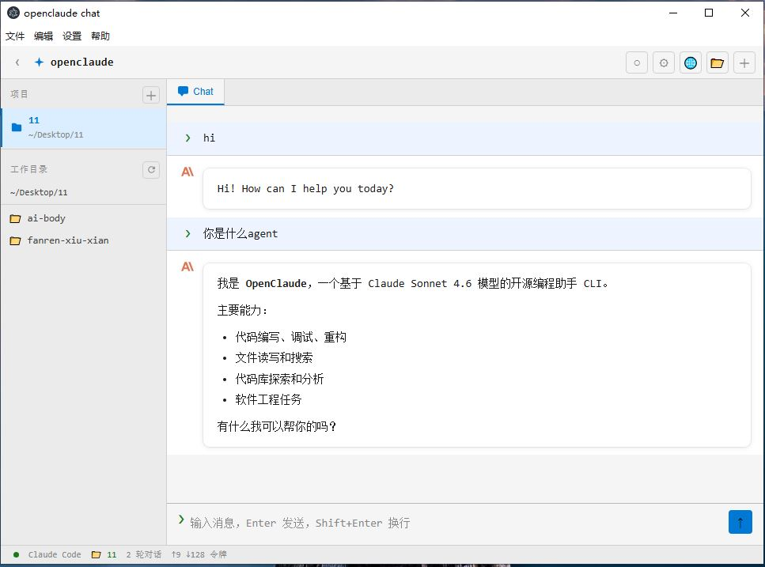
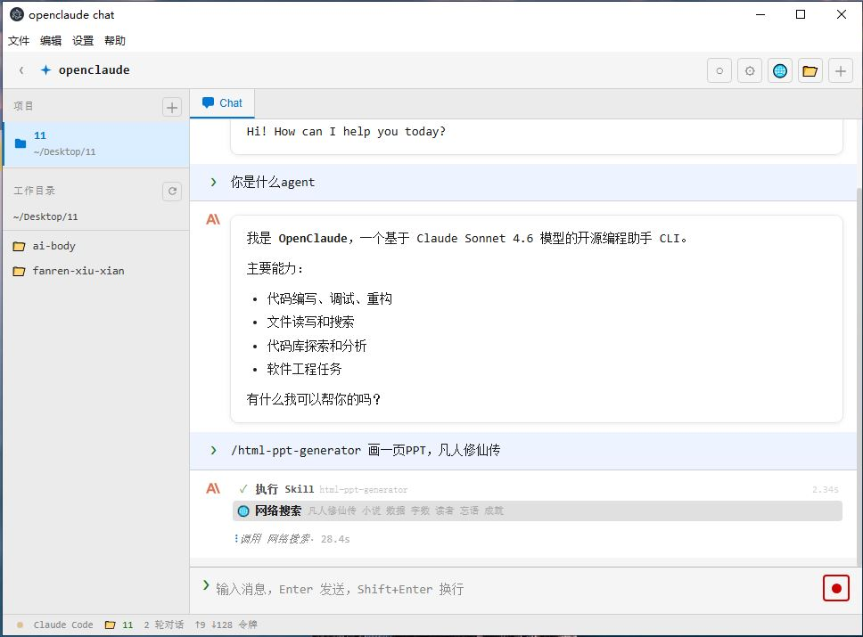

# OpenClaude UI

> 基于 [OpenClaude](https://github.com/Gitlawb/openclaude) 构建的桌面图形界面版本，封装为 Electron 应用，**无需安装 Node.js 或 Git**，解压即用。

[](dist-electron/)
[](dist-electron/)
[](LICENSE)
[](https://github.com/Gitlawb/openclaude)

---

## 界面预览

**主界面 — 项目侧边栏 + 聊天对话**



**Skill 执行 — 实时工具调用可视化**



---

## 核心特性

- **免安装运行** — 打包为独立 Electron 桌面应用，Windows 直接运行 `.exe`，无需 Node.js / Git / npm
- **图形界面** — 告别命令行，拥有完整的聊天 UI、项目侧边栏、工具调用可视化
- **多模型切换** — 支持 Claude、OpenAI、DeepSeek、Gemini、Ollama 等 200+ 模型，顶栏一键切换
- **Skill 系统** — 内置丰富 Skill（`/html-ppt-generator`、`/topic-analysis-article` 等），输入 `/` 即可调用
- **多项目管理** — 左侧项目栏管理多个工作目录，随时切换上下文
- **实时工具可视化** — 工具调用、网络搜索、文件操作全程可见，知道 AI 在做什么
- **MCP 支持** — 兼容 Model Context Protocol，可扩展外部工具

---

## 快速开始

### Windows（推荐）

直接下载 `openclaude-chat Setup 0.6.0.exe`，双击安装，或使用便携版解压后直接运行 `openclaude-chat.exe`。

---

## 提供商 & 模型配置

启动后点击顶栏 **提供商 & 模型配置** → **添加提供商** → **添加**，填入以下三项后保存：

| 字段 | 说明 |
|------|------|
| **API Key** | 对应平台申请的密钥 |
| **API 地址** | 接口 Base URL（末尾不带 `/`） |
| **Model** | 模型 ID，填写后需与平台一致 |

保存后在界面输入框输入 `hi` 发送，收到回复即配置成功。

### 常用提供商参考

**Anthropic Claude**
```
API Key:   sk-ant-api03-xxxxxxxx
API 地址:  https://api.anthropic.com
Model:     claude-sonnet-4-6
```

**OpenAI**
```
API Key:   sk-xxxxxxxx
API 地址:  https://api.openai.com/v1
Model:     gpt-4o
```

**DeepSeek**
```
API Key:   sk-xxxxxxxx
API 地址:  https://api.deepseek.com/v1
Model:     deepseek-chat
```

**OpenRouter**（聚合平台，支持数百个模型）
```
API Key:   sk-or-xxxxxxxx
API 地址:  https://openrouter.ai/api/v1
Model:     deepseek/deepseek-chat-v3-0324:free
```

**Ollama（本地模型，无需 API Key）**
```
API Key:   ollama
API 地址:  http://localhost:11434/v1
Model:     qwen2.5-coder:7b
```

> **提示：** API 地址填错是最常见的问题。Anthropic 不带 `/v1`，OpenAI 兼容接口一般带 `/v1`，以各平台文档为准。

---

## Skill 使用

在输入框输入 `/` 打开 Skill 列表，或直接输入 Skill 名称：

```
/html-ppt-generator 生成一份关于量子计算的PPT
/topic-analysis-article 分析《三体》的叙事结构
/html-report-generator 生成销售数据分析报告
```

Skill 执行时界面会实时展示每一步工具调用（网络搜索、文件生成等）。

---

## Agent 路由（多模型协作）

在 `~/.claude/settings.json` 中配置不同 Agent 使用不同模型：

```json
{
  "agentModels": {
    "deepseek-chat": {
      "base_url": "https://api.deepseek.com/v1",
      "api_key": "sk-your-key"
    },
    "claude-sonnet-4-6": {
      "api_key": "sk-ant-your-key"
    }
  },
  "agentRouting": {
    "Explore": "deepseek-chat",
    "Plan": "claude-sonnet-4-6",
    "general-purpose": "claude-sonnet-4-6",
    "default": "deepseek-chat"
  }
}
```

---

## 从源码构建

需要 [Bun](https://bun.sh) 运行时：

```bash
bun install
bun run build:electron        # 构建 Electron 主进程
bun run chat                  # 开发模式启动
bun run build:chat:win        # 打包 Windows .exe
bun run build:chat:mac        # 打包 macOS .dmg
bun run build:chat:linux      # 打包 Linux AppImage
```

---

## 项目结构

```
├── electron/          # Electron 主进程 & 渲染层
├── src/               # OpenClaude 核心运行时
├── dist-electron/     # 打包输出（.exe / .dmg / AppImage）
├── images/            # 截图
└── docs/              # 文档
```

---

## 与原版 OpenClaude 的区别

| 功能 | OpenClaude CLI | OpenClaude UI |
|------|---------------|---------------|
| 运行方式 | 命令行终端 | 桌面图形界面 |
| 安装要求 | Node.js / npm | 无，解压即用 |
| 项目管理 | 手动切换目录 | 侧边栏可视化管理 |
| 工具可视化 | 文本输出 | 图形化实时展示 |
| Skill 调用 | `/skill` 命令 | 输入框 `/` 菜单 |
| 适用人群 | 开发者 | 所有用户 |

---

## 声明

本项目是基于 [OpenClaude](https://github.com/Gitlawb/openclaude) 的独立社区衍生版本，与 Anthropic 无关联。  
"Claude" 和 "Claude Code" 是 Anthropic PBC 的商标。详见 [LICENSE](LICENSE)。
